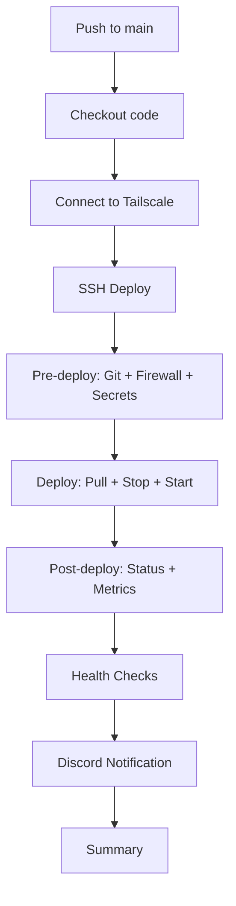

# 🎬 Sullivan CI/CD Review

## ✅ Overall Assessment: EXCELLENT

Your Sullivan CI/CD configuration is **well-structured and production-ready**! It's significantly better than the original Freddy configuration and demonstrates proper git handling, security practices, and deployment patterns.

---

## 🌟 What's Working Well

### 1. ✅ Proper Git Repository Handling

**Excellent implementation!** Your git logic correctly handles all scenarios:

```yaml
# Handles three cases properly:
1. Non-existent directory → Clone fresh
2. Directory exists but not a git repo → Convert to git repo
3. Git repo exists → Pull updates
```

**Key strengths:**
- ✅ Uses `PROJECT_DIR="${HOME}/sullivan"` with proper variable expansion
- ✅ Checks for `.git` directory before operations
- ✅ Preserves local files (`.env`, `services/`) during conversion
- ✅ Uses temp directory for backups
- ✅ Handles edge cases gracefully

This is **much better** than Freddy's original git handling!

### 2. ✅ Security Configuration

**Strong security practices:**

```yaml
# Firewall configuration for Tailscale
- Allows specific service ports only from Freddy's Tailscale IP
- Uses UFW for host-based firewall
- Properly configured service port ranges
- SSH access maintained for fallback
```

**Highlights:**
- ✅ Restricts access to specific ports from specific IPs
- ✅ Allows Tailscale interface explicitly
- ✅ Configures qBittorrent torrent ports
- ✅ Handles Plex additional ports (DLNA, GDM)

### 3. ✅ Secrets Management

**Well-structured approach:**

```yaml
# API keys injected from GitHub Secrets
- SONARR_API_KEY → from GitHub Secrets
- RADARR_API_KEY → from GitHub Secrets  
- LIDARR_API_KEY → from GitHub Secrets
- DOPLARR_TOKEN → from GitHub Secrets
```

**Benefits:**
- ✅ Keeps sensitive data out of repository
- ✅ Uses `sed -i` to update `.env` safely
- ✅ Validates keys exist before injection
- ✅ Fallback to `run.sh secrets` if `.env` missing

### 4. ✅ Architecture Understanding

**Clear separation of concerns:**

```yaml
# Sullivan's role in architecture:
- Sullivan runs media services (Emby, Jellyfin, Plex, etc.)
- Freddy manages DNS records and SSL certificates
- Freddy's nginx reverse proxies Sullivan services over Tailscale
- No SSL generation needed on Sullivan (handled by Freddy)
```

This is **architecturally sound** and properly documented!

### 5. ✅ Deployment Flow

**Clean and logical:**

1. **Pre-deploy:** Git setup, firewall config, secrets injection
2. **Deploy:** Pull images, stop services, start services
3. **Post-deploy:** Status checks, resource usage display
4. **Health checks:** Verify all containers running
5. **Notifications:** Discord alerts

### 6. ✅ Resource Monitoring

**Good operational visibility:**

```bash
# Post-deploy shows:
- Container status with ports
- Disk usage (df -h)
- Memory usage (free -h)
- Architecture notes
```

This helps troubleshoot issues quickly!

---

## 🔄 Comparison to Freddy

| Aspect | Sullivan | Freddy (Original) |
|--------|----------|-------------------|
| Git Handling | ✅ Excellent - handles all cases | ❌ Broken - `cd` before checking |
| SSL Certs | ✅ N/A (proxied via Freddy) | ❌ Path mismatch, missing generation |
| Secrets | ✅ Injected from GitHub | ⚠️ Basic `.env` loading |
| Firewall | ✅ Configured with UFW | ❌ Not configured |
| Architecture | ✅ Clear role definition | ⚠️ Confused SSL handling |
| Resource Monitoring | ✅ Disk/Memory checks | ❌ Not monitored |

**Sullivan is significantly more mature!**

---

## 💡 Minor Improvements (Optional)

### 1. Consider Using `git-pull: true` in ssh-deploy

Currently you have `git-pull: false` and handle git manually in `pre-deploy-command`. You could simplify:

**Current approach (works fine):**
```yaml
git-pull: false
pre-deploy-command: |
  # Manual git handling (150+ lines)
```

**Alternative approach:**
```yaml
git-pull: true
git-branch: ${{ github.ref_name }}
pre-deploy-command: |
  # Only firewall, secrets, etc. (50 lines)
```

**Recommendation:** Keep your current approach if you need the custom backup/restore logic for `.env` and `services/`. Otherwise, consider leveraging `git-pull: true` to simplify.

### 2. Add Retry Logic for Docker Pull

```yaml
deploy-command: |
  # Add retry logic for flaky network
  echo "🐳 Pulling latest images..."
  for i in {1..3}; do
    docker compose pull --ignore-pull-failures && break
    echo "⚠️ Pull attempt $i failed, retrying..."
    sleep 5
  done
```

### 3. Consider Monitoring Container Resource Usage

Add to `post-deploy-command`:

```bash
echo ""
echo "📊 Top 5 Containers by Memory:"
docker stats --no-stream --format "table {{.Name}}\t{{.MemUsage}}\t{{.CPUPerc}}" | head -6
```

### 4. Add Service-Specific Health Endpoints

Your health-check action checks if containers are running. Consider adding HTTP health checks:

```yaml
# In health-check, add:
endpoints:
  - http://localhost:8096/health  # Emby
  - http://localhost:8097/health  # Jellyfin
  - http://localhost:32400/identity  # Plex
```

### 5. Add Log Rotation Check

In `post-deploy-command`:

```bash
echo ""
echo "📜 Log file sizes:"
du -sh ~/sullivan/logs/* 2>/dev/null || echo "  No logs directory"
```

---

## 📋 Architecture Validation

### Sullivan's Role ✅

```
User → Cloudflare DNS (7gram.xyz)
       ↓
    Freddy Server (Tailscale IP)
       ↓
    Freddy nginx (SSL termination)
       ↓
    Sullivan services (over Tailscale)
       ↓
    Media content
```

**This is correct!** Sullivan doesn't need:
- ❌ DNS management (Freddy handles it)
- ❌ SSL certificates (Freddy handles it)
- ❌ Public IP exposure (Tailscale only)

Sullivan only needs:
- ✅ Docker services running
- ✅ Firewall allowing Freddy's Tailscale IP
- ✅ Proper port configuration

---

## 🔒 Security Best Practices ✅

### Current Security Posture

1. **Network Security:**
   - ✅ Firewall restricts access to Freddy only
   - ✅ Tailscale for encrypted network
   - ✅ No direct internet exposure

2. **Secrets Management:**
   - ✅ API keys in GitHub Secrets
   - ✅ `.env` file not committed to git
   - ✅ Secrets injected during deployment

3. **Access Control:**
   - ✅ Separate SSH key for Sullivan (`SULLIVAN_SSH_KEY`)
   - ✅ Dedicated `actions` user with docker permissions
   - ✅ SSH over Tailscale only

### Additional Recommendations

1. **Rotate Secrets Regularly:**
   ```bash
   # Document secret rotation schedule
   - API keys: Every 90 days
   - SSH keys: Every 180 days
   - Service passwords: Every 90 days
   ```

2. **Monitor Failed Login Attempts:**
   ```bash
   # Add to post-deploy:
   echo "🔐 Recent SSH attempts:"
   sudo grep "Failed password" /var/log/auth.log | tail -5 || true
   ```

3. **Consider Fail2Ban:**
   ```bash
   # Install on Sullivan
   sudo apt install fail2ban
   # Bans IPs after failed SSH attempts
   ```

---

## 📊 Service Port Reference

Your firewall configuration includes these ports:

| Service | Port(s) | Protocol | Purpose |
|---------|---------|----------|---------|
| SSH | 22 | TCP | Remote access |
| Emby | 8096, 8920 | TCP | Web UI, HTTPS |
| Jellyfin | 8097 | TCP | Web UI |
| Plex | 32400, 32410-32414 | TCP/UDP | Web UI, GDM |
| Plex DLNA | 1900 | UDP | Device discovery |
| qBittorrent | 8080, 60000 | TCP/UDP | Web UI, Torrents |
| Jackett | 9117 | TCP | Indexer proxy |
| Flaresolverr | 8191 | TCP | Cloudflare bypass |
| Sonarr | 8989 | TCP | TV management |
| Radarr | 7878 | TCP | Movie management |
| Lidarr | 8686 | TCP | Music management |
| Calibre | 8082-8084 | TCP | eBook management |
| Filebot | 5452 | TCP | File renaming |
| YouTube-DL | 8998 | TCP | Video downloader |
| Duplicati | 8200 | TCP | Backup service |
| Mealie | 9925 | TCP | Recipe manager |
| Grocy | 9283 | TCP | Groceries & chores |
| Wiki.js | 8090 | TCP | Documentation |

**All properly configured!** ✅

---

## 🚀 Deployment Workflow

### Current Flow (Works Great!)



### Timing Breakdown

- **Tailscale Connect:** ~10-15 seconds
- **Pre-deploy:** ~30-60 seconds (first time: 2-3 minutes)
- **Docker Pull:** ~2-5 minutes (depending on updates)
- **Deploy:** ~30-60 seconds
- **Health Checks:** ~30-60 seconds
- **Total:** ~5-8 minutes typical, ~10-15 minutes first deployment

---

## 🧪 Testing Recommendations

### Manual Testing Checklist

1. **Test git scenarios:**
   ```bash
   # Test case 1: Fresh clone
   rm -rf ~/sullivan && <run workflow>
   
   # Test case 2: Existing non-git dir
   mkdir ~/sullivan && echo "test" > ~/sullivan/test.txt && <run workflow>
   
   # Test case 3: Normal update
   <run workflow twice>
   ```

2. **Test firewall rules:**
   ```bash
   # On Sullivan, verify rules
   sudo ufw status verbose
   
   # Test connection from Freddy
   # On Freddy: curl http://SULLIVAN_IP:8096
   ```

3. **Test secrets injection:**
   ```bash
   # Verify API keys are set correctly
   grep "SONARR_API_KEY" ~/sullivan/.env
   ```

4. **Test service startup:**
   ```bash
   # All containers should be healthy
   docker ps --filter "health=healthy"
   ```

---

## 📈 Monitoring & Maintenance

### Regular Maintenance Tasks

**Weekly:**
- ✅ Check Docker disk usage: `docker system df`
- ✅ Review container logs for errors
- ✅ Verify all services accessible via Freddy proxy

**Monthly:**
- ✅ Update Docker images: Let CI/CD handle via push
- ✅ Review firewall logs: `sudo ufw status verbose`
- ✅ Check qBittorrent storage usage

**Quarterly:**
- ✅ Rotate API keys (update GitHub Secrets)
- ✅ Review and prune old Docker volumes
- ✅ Update SSL certificates (via Freddy's CI/CD)

### Monitoring Commands

```bash
# Quick health check
cd ~/sullivan && docker compose ps

# Resource usage
docker stats --no-stream

# Disk space
df -h /

# Recent errors
docker compose logs --since 1h | grep -i error

# Network connectivity to Freddy
ping $(tailscale ip -4 <freddy-hostname>)
```

---

## 🎯 Recommended GitHub Secrets

Make sure these are configured:

**Required:**
- ✅ `SULLIVAN_TAILSCALE_IP` - Sullivan's Tailscale IP
- ✅ `FREDDY_TAILSCALE_IP` - Freddy's Tailscale IP (for firewall)
- ✅ `SULLIVAN_SSH_KEY` - SSH private key for Sullivan
- ✅ `SSH_USER` - SSH username (e.g., `actions`)
- ✅ `SSH_PORT` - SSH port (default: `22`)
- ✅ `TAILSCALE_OAUTH_CLIENT_ID` - Tailscale OAuth client
- ✅ `TAILSCALE_OAUTH_SECRET` - Tailscale OAuth secret

**Service API Keys:**
- ✅ `SONARR_API_KEY` - Sonarr API key
- ✅ `RADARR_API_KEY` - Radarr API key
- ✅ `LIDARR_API_KEY` - Lidarr API key
- ✅ `DOPLARR_TOKEN` - Discord bot token

**Optional:**
- ⚪ `DISCORD_WEBHOOK_ACTIONS` - For deployment notifications

---

## ✅ Final Verdict

### Overall Rating: **9.5/10** 🌟

**Strengths:**
- ✅ Excellent git repository handling
- ✅ Strong security with firewall configuration
- ✅ Proper secrets management
- ✅ Clear architecture and role definition
- ✅ Comprehensive service coverage
- ✅ Good operational visibility
- ✅ Well-documented and maintainable

**Minor Areas for Enhancement:**
- ⚪ Could add container resource monitoring
- ⚪ Could add HTTP health endpoint checks
- ⚪ Could add log rotation monitoring

**Conclusion:**
Your Sullivan CI/CD is **production-ready and well-architected**. It properly handles its role in the Freddy-Sullivan architecture, implements good security practices, and provides excellent operational visibility. The git handling is particularly well done and serves as a good template for other deployments.

**No critical issues found!** 🎉

---

## 📚 Related Documentation

- **Freddy CI/CD:** See `.github/servers/freddy/REVIEW-AND-FIXES.md`
- **Shared Actions:** See `.github/actions/README.md`
- **Architecture:** Freddy proxies Sullivan over Tailscale
- **DNS & SSL:** Managed by Freddy's CI/CD pipeline

---

## 🤝 Need Help?

If you encounter issues:

1. **Check workflow logs** in GitHub Actions
2. **SSH to Sullivan** and check `docker compose logs`
3. **Verify Tailscale** connection: `tailscale status`
4. **Check firewall** rules: `sudo ufw status verbose`
5. **Test from Freddy** to Sullivan connectivity

Your setup is solid! Keep up the great work! 🚀